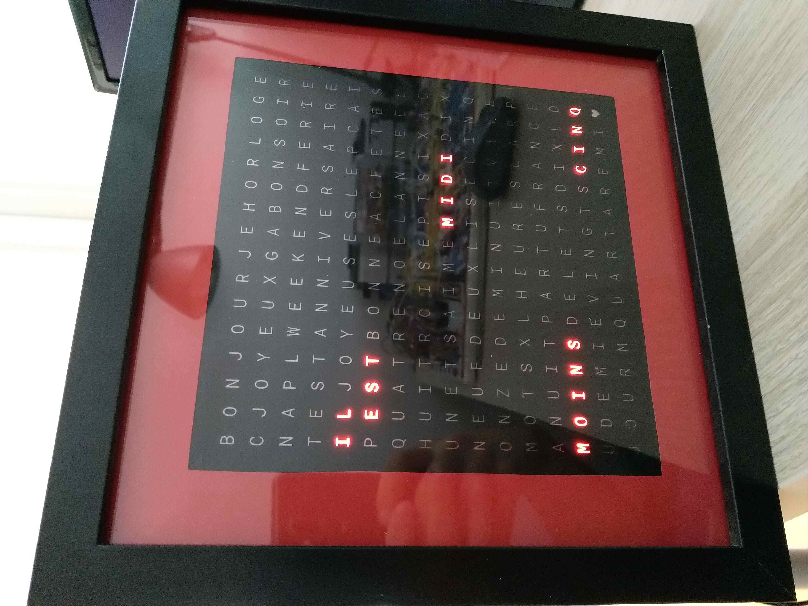
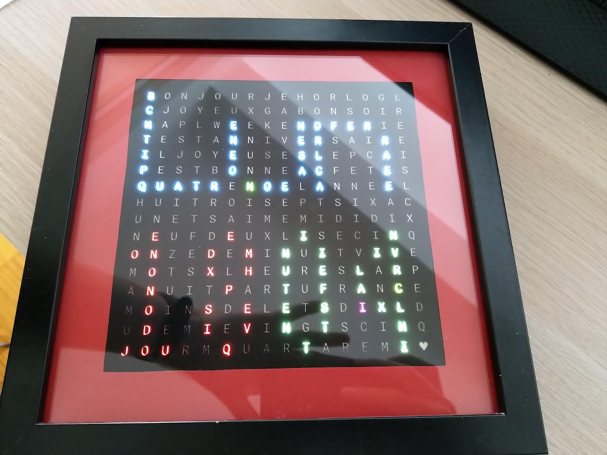

# Wordclock

This repository contains source code and CAD files to build and program a
wordclock.

The wordclock is designed inside an IKEA frame (SANNAHED, 25x25 cm). Behind the
front glass panel, a black mask allows light through transparent letters which
are individually backlighted with colour LEDs.

The clock displayed in the picture above spells out the time in French
(*il est midi moins cinq: it is five to noon*), but
design can easily be adapted to other languages. In addition to time of the day,
extra text for special days (*i.e.* birthdays) is highlighted in other colours.
Letters can be used as pixels to display other forms of text. The picture below
displays today's date (*Lun 18 04*: Monday *Lundi* the 18th of April).

Lights are controlled via custom printed circuit boards, multichannel LED driver
integrated circuits, and an Arduino Nano Every board breaking out a AVR XMEGA
4809 microcontroller. Timekeeping is performed with an accurate Real Time Clock
(RTC, DS3231M). The clock is powered via 5V/4A on a barrel jack, and the RTC is
internaly powered from a coin cell to ensure timekeeping even when the clock is
unplugged.

The source code attempts to follow SOLID principles. It should be easy to update
by anyone willing to add features, modify the word layout, alter colours, add
animations, and so on. As examples, the git repository includes extra behaviours
for the clock:

- it can display time with numbers, using letters as pixels
  ([source](src/Behaviour/TimeInNumbers/)),
- similarly, it can display the date ([source](src/Behaviour/DateInNumbers/)),
- on startup, it shows a splash screen with a welcome message
  ([source](src/Behaviour/HelloMessage/)),
- to debug electrical connecticity and software mappings, LEDs can be controlled
to blink one at a time ([source](src/Behaviour/BlinkOneAtATime/)),

All behaviours can be loaded on the clock, one can then use physical buttons at
the back of the frame to switch between behaviours. These buttons also permit to
adjust the time and date.

# LICENSE

Unless otherwise mentioned, the source code is licensed by Rémi Berthoz under
the [MIT License](LICENSE.txt). Exceptions are:

- The OneButton library (in `src/Protocols/OneButtons`) used to control the
  hardware push-buttons, which is licensed by Matthias Hertel under a BSD style
  license (http://www.mathertel.de/License.aspx).

- The USB USART library (in `src/Protocols/USB_USART`), adapted from
  [ArduinoCore-megaavr](https://github.com/arduino/ArduinoCore-megaavr), which
  is licensed by Arduino SA. under the terms of the GNU Lesser General Public
  License.

- The `src/millis.cpp` file, adapted from
  [ArduinoCore-megaavr](https://github.com/arduino/ArduinoCore-megaavr), which
  is licensed by Arduino SA. under the terms of the GNU Lesser General Public
  License.
